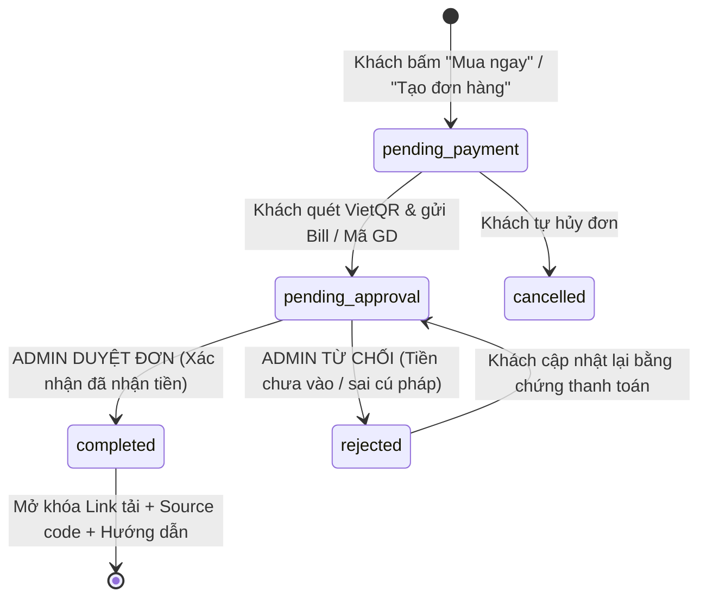

# .sdd/constraints/business.md — Business & Domain Constraints

Version: 1.0.0 | Owner: @product-lead | Status: ACTIVE

## 1. 3 DANH MỤC SẢN PHẨM CỐT LÕI (CORE CATEGORIES)

Hệ thống được thiết kế đặc thù để thương mại hóa 3 nhóm sản phẩm số chính:

### Danh Mục 1: Tools (Công Cụ Phần Mềm)
- **Đặc điểm:** Các phần mềm tiện ích, automation scripts, bot cào dữ liệu, extension trình duyệt, desktop apps phục vụ công việc học tập/lập trình.
- **Yêu cầu demo:**
  - Video quay thao tác tool thực tế (YouTube hoặc MP4 embed).
  - Screenshots các giao diện chức năng chính.
  - Cấu hình yêu cầu hệ thống (OS, RAM, Prerequisites).
  - Hướng dẫn kích hoạt / cài đặt sau khi mua.

### Danh Mục 2: Projects (Đồ Án & Dự Án Môn Học)
- **Đặc điểm:** Source code đồ án tốt nghiệp, project môn học (SE, Web Development, Mobile App, AI/ML), kèm báo cáo mẫu, sơ đồ kiến trúc (ERD, Sequence, Use Case).
- **Yêu cầu demo:**
  - Live Demo Link (đường link trực tiếp vào website/app đang chạy thực tế).
  - Gallery hình ảnh đầy đủ từ Landing Page, Dashboard đến Admin panel của đồ án.
  - Tech Stack tags (Frontend, Backend, Database).
  - Mục lục báo cáo và hướng dẫn deploy.

### Danh Mục 3: LAB211 Source Code (Java OOP Labs)
- **Đặc điểm:** Toàn bộ mã nguồn chuẩn cho môn học Lập trình Java Hướng đối tượng LAB211 (chuẩn sinh viên FPT University và các trường ĐH CNTT), gồm các bài lab kinh điển (ví dụ: J1.S.P0001 Bubble Sort, J1.S.P0074 Matrix, J1.S.P0021 Student Management, J1.S.P0071 Task Manager,...).
- **Yêu cầu demo:**
  - Code snippet preview (cho xem đoạn code cấu trúc OOP mẫu, interface/class diagram).
  - Screenshots màn hình console chạy test cases / menu chương trình.
  - Cam kết Clean code, tuân thủ Java Naming Conventions, có comment giải thích thuật toán.

---

## 2. QUY TRÌNH THANH TOÁN & BÀN GIAO SẢN PHẨM SỐ (PAYMENT & DELIVERY LIFECYCLE)

### Vòng Đời Đơn Hàng (Order State Machine)

### Nguyên Tắc Bắt Buộc Về Phê Duyệt Của Admin (Admin Approval Rule)
1. **Khách KHÔNG thể truy cập tài nguyên số ngay lập tức sau khi gửi bill**:
   - Trạng thái đơn hàng sau khi gửi bill là `pending_approval`.
   - Màn hình thông báo: "Đơn hàng của bạn đang được Admin kiểm tra và duyệt. Nội dung sẽ được mở khóa ngay sau khi xác nhận thanh toán."
2. **Chỉ Admin mới có thẩm quyền chuyển trạng thái sang `completed`**:
   - Admin kiểm tra tài khoản ngân hàng trùng khớp với số tiền `total_amount` và nội dung `vietqr_content`.
   - Khi Admin bấm "Duyệt Đơn" (`approve`), hệ thống ghi log `audit_logs` và chuyển status sang `completed`.
3. **Mở khóa tài nguyên sau khi duyệt**:
   - Khi trạng thái là `completed`, nút "Tải Mã Nguồn" và "Xem Hướng Dẫn Kích Hoạt" trên trang `/customer/orders/:id` mới trở nên khả dụng.
   - Link tải được sinh động dưới dạng Signed URL từ Supabase Storage với thời gian sống 60 phút (chống leak link cố định).

---

## 3. CƠ CHẾ HIỂN THỊ DEMO ĐA PHƯƠNG TIỆN (RICH DEMO ENGINE)

Mọi sản phẩm bất kể thuộc danh mục nào đều KHÔNG ĐƯỢC chỉ có một ảnh duy nhất:
- **Admin Interface:** Hỗ trợ form CRUD trực quan để nhập:
  - Mảng danh sách ảnh demo (URL ảnh hoặc upload trực tiếp).
  - Đường dẫn Live Demo (`https://demo-app.com`).
  - Đường dẫn Video Demo (`https://youtu.be/...` hoặc direct MP4).
  - Danh sách tính năng chính (mỗi tính năng là 1 bullet point).
  - Bộ thẻ công nghệ (Tech stack tags).
  - Đoạn mã nguồn xem trước (Syntax highlighted code block).
- **Customer Storefront:** Trình diễn các nội dung demo theo tab hoặc interactive split-view cực đẹp, kết hợp modal xem ảnh phóng to (Lightbox) và video player mượt mà.

---

## 4. TÍNH NĂNG ADMIN PORTAL & DASHBOARD

Admin Portal phải có đầy đủ tính năng CRUD và thống kê:

### 1. Dashboard Thống Kê (Analytics)
- Tổng doanh thu tích lũy (VND)
- Doanh thu hôm nay / tuần này / tháng này
- Tổng số đơn hàng thành công
- Số lượng đơn hàng đang chờ duyệt (`pending_approval`) — có badge cảnh báo đỏ nổi bật
- Biểu đồ biến động doanh thu theo thời gian
- Top 5 sản phẩm bán chạy nhất

### 2. Quản Lý Đơn Hàng (Orders CRUD & Approval)
- Danh sách đơn hàng với phân trang, tìm kiếm theo `order_code`, khách hàng, ngày đặt.
- Bộ lọc theo trạng thái (`pending_approval`, `completed`, `rejected`).
- Drawer/Modal xem chi tiết: Xem ảnh bill khách upload, mã giao dịch, sản phẩm trong đơn.
- 2 nút hành động chính: **[Duyệt Đơn]** và **[Từ Chối]** (có ô nhập lý do gửi cho khách).

### 3. Quản Lý Sản Phẩm (Products CRUD & Demo Management)
- Thêm mới sản phẩm với đầy đủ trường dữ liệu (Giá, Danh mục, Deliverable file zip, Hướng dẫn).
- Cập nhật thông tin và cập nhật demo links/gallery.
- Xóa mềm sản phẩm (chuyển `status = 'archived'` hoặc set `deleted_at`).

### 4. Quản Lý Khách Hàng (Customer Management)
- Xem danh sách người dùng, tổng số đơn đã mua, trạng thái tài khoản.

---

## 5. DOMAIN GLOSSARY (THUẬT NGỮ CHUẨN)
- **Deliverable**: Dữ liệu giá trị số được bàn giao sau khi mua (file zip source code, link repository GitHub, tài liệu hướng dẫn, license key).
- **VietQR**: Chuẩn mã QR thanh toán liên ngân hàng Napas 247, tự động điền STK, tên chủ thẻ, số tiền và nội dung chuyển khoản.
- **Signed URL**: Đường link tải file tạm thời do Supabase Storage sinh ra, tự hết hạn sau 60 phút nhằm bảo vệ bản quyền phần mềm.
- **Pending Approval**: Trạng thái đơn hàng đã được khách hàng thanh toán và đang chờ Admin đối soát ngân hàng.
