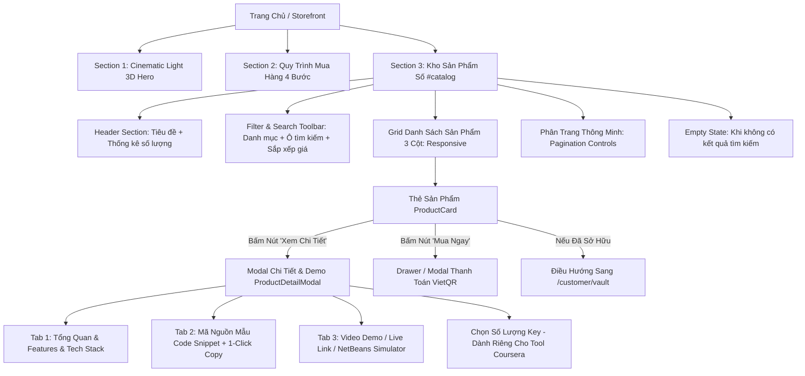

# 🛒 Đặc Tả Giao Diện Kho Sản Phẩm (Storefront Product Catalog UI)

> **File:** `UI_KHO_SAN_PHAM.md`  
> **Áp dụng cho:** Trang chủ Storefront (`src/app/page.tsx`), Component thẻ sản phẩm (`ProductCard.tsx`), và Modal chi tiết/demo (`ProductDetailModal.tsx`).  
> **Phong cách chủ đạo:** Modern Clean SaaS kết hợp Japanese Editorial Minimalism (`#fafbfc`), bề mặt Card trắng thanh lịch (`#ffffff`), viền Slate tinh tế (`border-slate-200/90`), điểm nhấn Xanh Hoàng Gia (`#2563eb`).

---

## 📌 1. Tổng Quan & Triết Lý Thiết Kế (Design Philosophy)

### 1.1 Mục Đích
Kho sản phẩm ngoài Storefront là "mặt tiền số" quan trọng nhất của hệ sinh thái CodeVault Studio. Giao diện được thiết kế nhằm:
- **Tối ưu hóa thời gian tìm kiếm**: Giúp sinh viên IT và kỹ sư công nghệ tìm thấy mã nguồn (LAB211 Java OOP, Đồ án Capstone, Công cụ Automation) chỉ trong 3 cú nhấp chuột.
- **Xây dựng độ tin cậy tuyệt đối**: Cung cấp đầy đủ bằng chứng chất lượng gồm ảnh thực tế, video demo, code mẫu xem trước (code preview snippet) và giả lập console NetBeans ngay trên trình duyệt.
- **Trải nghiệm mua hàng tức thì**: Tích hợp trạng thái "Đã sở hữu" nếu khách hàng đã thanh toán trước đó, chuyển hướng mượt mà sang thanh toán VietQR quét mã tự động.

### 1.2 Nguyên Tắc Cốt Lõi
1. **Clarity Over Clutter**: Không nhồi nhét popup gây phiền toái; bố cục thông thoáng, khoảng trắng (whitespace) có chủ đích.
2. **Instant Feedback**: Tìm kiếm và lọc danh mục xử lý phía Client với độ trễ phản hồi < 50ms, không reload trang.
3. **Hierarchy & Visual Weight**: Phân cấp rõ rệt giữa Tiêu đề sản phẩm -> Tags công nghệ -> Mức giá nổi bật -> Nút hành động kêu gọi mua hàng (CTA).

---

## 🎨 2. Hệ Thống Design Tokens & Bảng Màu (Color Palette)

Giao diện tuân thủ quy chuẩn thiết kế từ `design.md`:

### 2.1 Bảng Màu Nhận Diện & Thao Tác
| Phân Loại | Mã Màu Hex / Class Tailwind | Mục Đích Sử Dụng |
| :--- | :--- | :--- |
| **Nền Trang (Canvas)** | `#fafbfc` (`bg-[#fafbfc]`) | Nền tổng thể mang cảm giác sạch sẽ, hiện đại |
| **Card Surface** | `#ffffff` (`bg-white`) | Khung thẻ sản phẩm, filter bar, modal |
| **Primary Blue** | `#2563eb` (`text-blue-600`) | Giá bán, icon active, viền hover, nút phân trang hiện tại |
| **Primary Gradient** | `from-blue-600 to-indigo-600` | Nút "Mua Ngay", nút lọc Active, CTA Hero |
| **Primary Shadow** | `shadow-blue-500/25` | Hiệu ứng đổ bóng phát sáng cho các nút quan trọng |

### 2.2 Bảng Màu Danh Mục (Category System)
| Danh Mục | Key Value | Màu Nền / Chữ / Viền | Icon Đại Diện |
| :--- | :--- | :--- | :--- |
| **LAB211 OOP Java** | `lab211` | Nền: `#ecfdf5` (`bg-emerald-50`)<br>Chữ: `#047857` (`text-emerald-700`)<br>Viền: `#a7f3d0` (`border-emerald-200`) | `<Code2 />` / `<Code />` |
| **Project & Assignment** | `project` | Nền: `#faf5ff` (`bg-purple-50`)<br>Chữ: `#7e22ce` (`text-purple-700`)<br>Viền: `#e9d5ff` (`border-purple-200`) | `<Layers />` |
| **Tiện Ích Tool** | `tool` | Nền: `#eff6ff` (`bg-blue-50`)<br>Chữ: `#1d4ed8` (`text-blue-700`)<br>Viền: `#bfdbfe` (`border-blue-200`) | `<Wrench />` |

### 2.3 Bảng Màu Trạng Thái (Status & Ownership)
| Trạng Thái | Badge Visual | Ý Nghĩa |
| :--- | :--- | :--- |
| **Đã sở hữu** | `bg-emerald-500 text-white` kèm icon `<CheckCircle />` | Khách đã mua thành công gói này, nút CTA chuyển thành "Vào kho tải" |
| **Giảm giá (-X%)** | `bg-rose-500 text-white font-extrabold` | Tỷ lệ giảm giá so với `original_price` |
| **Sở hữu vĩnh viễn** | `text-slate-400 font-medium` | Ghi chú dưới giá tiền cho LAB211 & Projects |
| **Gói 30 ngày / TK** | `text-slate-400 font-medium` | Áp dụng độc quyền cho công cụ gia hạn theo kỳ (Coursera Skip Tool) |

---

## 📐 3. Bố Cục Kiến Trúc Toàn Trang (Catalog Layout Architecture)



---

## 🖥️ 4. Đặc Tả Chi Tiết Từng Khối Giao Diện (Component Specifications)

### 4.1 Khối 1: Header & Thanh Thống Kê Số Lượng
- **Vị trí**: Đỉnh section `#catalog`
- **Thành phần**:
  - **Badge nhỏ**: Icon `<Code2 />` + chữ `DANH MỤC SẢN PHẨM SỐ` (Màu xanh dương đậm, chữ hoa, `tracking-wider`).
  - **Tiêu đề chính (`h2`)**: `Khám Phá & Đặt Mua Tài Nguyên` (`text-2xl sm:text-3xl font-black text-slate-900 tracking-tight`).
  - **Đoạn mô tả ngắn**: Cam kết mã nguồn sạch, đã qua kiểm duyệt, không chứa mã độc và có tài liệu chi tiết.
  - **Hộp đếm số lượng (Right Counter)**: 
    - Nền trắng, viền mờ `border-slate-200`, đổ bóng nhẹ `shadow-sm`.
    - Dạng hiển thị: `Hiển thị [Từ 1..X] / [Tổng Y] sản phẩm`.

### 4.2 Khối 2: Thanh Công Cụ Lọc & Tìm Kiếm (Toolbar Filter Bar)
- **Container**: `bg-white p-4 rounded-card border border-slate-200/80 shadow-card mb-8`.
- **Hàng 1 — Nhóm nút Lọc Danh Mục (Category Pills)**:
  - Cho phép người dùng chọn:
    1. **Tất Cả** (kèm tổng số sản phẩm `published`).
    2. **LAB211 OOP Java** (Icon `<Code2 />`).
    3. **Project & Assignment** (Icon `<Layers />`).
    4. **Tiện Ích Tool** (Icon `<Wrench />`).
  - **Trạng thái Active**: Nền `bg-blue-600 text-white shadow-md shadow-blue-500/25`.
  - **Trạng thái Inactive**: Chữ `text-slate-600`, hover đổi nền `hover:bg-slate-100`.
  - Hỗ trợ cuộn ngang trên điện thoại di động (`overflow-x-auto whitespace-nowrap`).
- **Hàng 2 — Ô Tìm Kiếm Tức Thì (Instant Search Input)**:
  - Icon kính lúp `<Search />` nằm ở góc trái ô nhập liệu.
  - Placeholder: `"Tìm theo tên bài, môn học, công nghệ (Java, Spring, Next.js)..."`.
  - Nút xóa nhanh `✕` xuất hiện ở góc phải khi có nội dung gõ.
  - Tìm kiếm theo cơ chế: Tiêu đề (`title`), mô tả ngắn (`short_description`), và các thẻ công nghệ (`demo.tech_stack_tags`).
- **Hàng 3 — Bộ Sắp Xếp (Sort Dropdown)**:
  - Tùy chọn sắp xếp trong thẻ `<select>`:
    - `featured`: Nổi bật nhất (mặc định theo thứ tự biên tập).
    - `newest`: Mới cập nhật (theo ngày tạo gần nhất).
    - `price-asc`: Giá: Thấp đến cao.
    - `price-desc`: Giá: Cao đến thấp.

---

### 4.3 Khối 3: Thẻ Sản Phẩm (ProductCard Component)
Mỗi sản phẩm hiển thị dưới dạng Card độc lập với kích thước tỉ lệ vàng, có viền bo tròn hiện đại:

```
+--------------------------------------------------------------+
| [Badge Danh Mục]                       [Badge -30% / Đã Mua] |
|                                                              |
|                  Ảnh Bìa Sản Phẩm (3:2)                      |
|                                                              |
+--------------------------------------------------------------+
| Tiêu đề sản phẩm (Line-clamp-2, font-black, hover:blue)      |
| Mô tả ngắn súc tích tóm tắt bài tập/đồ án (Line-clamp-2)     |
| [Tag: Java] [Tag: Swing] [Tag: OOP] [+2]                     |
+--------------------------------------------------------------+
| Giá: 199.000 đ   ~~299.000 đ~~          [ 👁️ ] [ 🛍️ Mua ngay ] |
| (Sở hữu vĩnh viễn)                                           |
+--------------------------------------------------------------+
```

#### Các Yếu Tố Chi Tiết Của ProductCard:
1. **Khu Vực Ảnh Thumbnail (Aspect Ratio 3:2)**:
   - Hiệu ứng zoom nhẹ khi hover: `group-hover:scale-105 transition-transform duration-500`.
   - Lớp gradient mờ nhẹ ở đáy ảnh để tạo độ sâu thị giác.
   - **Góc trên bên trái**: Badge danh mục với viền mờ backdrop (`bg-white/90 backdrop-blur-md`).
   - **Góc trên bên phải**: 
     - Nếu đã mua: Badge xanh lá `Đã sở hữu` với icon `<CheckCircle />`.
     - Nếu chưa mua và có giá gốc: Badge giảm giá màu đỏ tươi `-X%`.
2. **Khu Vực Nội Dung**:
   - **Tên sản phẩm**: `font-extrabold text-slate-900 line-clamp-2 cursor-pointer hover:text-blue-600`.
   - **Mô tả ngắn**: Chữ xám thanh nhã `text-slate-500 text-xs line-clamp-2`.
   - **Danh sách Tag công nghệ**: Hiển thị tối đa 3 tag đầu tiên, nếu còn dư thì hiển thị badge phụ `+N`.
3. **Khu Vực Chân Thẻ (Card Footer)**:
   - **Cụm giá tiền**:
     - Giá hiện tại: `text-lg font-black text-blue-600`.
     - Giá gốc: Chữ nhỏ gạch ngang `text-[11px] text-slate-400 line-through`.
     - Ghi chú chu kỳ sở hữu: "Sở hữu vĩnh viễn" hoặc "Gói 30 ngày / tài khoản".
   - **Cụm nút tương tác**:
     - Nút **Xem chi tiết & Demo** (Icon con mắt `<Eye />`): Mở modal preview.
     - Nút **Mua ngay** (Icon giỏ hàng `<ShoppingBag />`): Kích hoạt quy trình mua hàng.
     - *Ngoại lệ*: Nếu người dùng đã sở hữu sản phẩm, nút chuyển thành **Vào kho tải** màu xanh ngọc (`bg-emerald-50 text-emerald-700 border-emerald-200`) dẫn thẳng đến trang `/customer/vault`.

---

### 4.4 Khối 4: Modal Chi Tiết & Demo (ProductDetailModal Component)
Hỗ trợ khách hàng soi xét kỹ lưỡng từng dòng code, xem video và trải nghiệm trước khi xuống tiền:

#### Cấu Trúc Khung Modal:
- **Lớp nền (Backdrop)**: `bg-slate-900/70 backdrop-blur-md fixed inset-0 z-50`.
- **Hộp thoại (Dialog Frame)**: Bo góc lớn `rounded-card`, viền xám trắng, bóng đổ sâu `shadow-2xl`, chiều cao tối đa `max-h-[92vh]` có thanh cuộn riêng biệt.
- **Thanh tiêu đề Modal (Header Bar)**:
  - Badge danh mục in hoa.
  - Mã định danh sản phẩm (`ID: [slug]`).
  - Nút đóng modal `✕` với hiệu ứng hover mượt mà.

#### Nội Dung Bên Trong Modal:
1. **Phần Thông Tin Đỉnh (Header Summary)**:
   - Tên sản phẩm đầy đủ cỡ chữ lớn.
   - Mô tả súc tích.
   - Mức giá lớn nổi bật bên phải.
   - **Bộ Tăng/Giảm Số Lượng (Chỉ hiển thị cho công cụ Coursera)**:
     - Nút `-` và `+` để mua nhiều license key cho nhóm bạn cùng học.
     - Tự động nhân cấp số nhân giá tiền theo công thức: `Tổng = Đơn giá × Số lượng`.
2. **Khu Vực Trưng Bày Đa Phương Tiện (Image Gallery)**:
   - Khung xem ảnh lớn tỉ lệ 16:9 sắc nét.
   - Dải ảnh thu nhỏ (Thumbnails Carousel) bên dưới cho phép nhấp chọn đổi góc nhìn.
3. **Hệ Thống Tab Đa Năng (Interactive Tab System)**:
   - **Tab 1: Tổng Quan (Overview)**:
     - Danh sách đặc điểm nổi bật (`features_list`) với icon dấu tích xanh.
     - Toàn bộ các công cụ / thư viện công nghệ sử dụng (`tech_stack_tags`).
     - Nội dung mô tả chuyên sâu render chuẩn Markdown thông qua `ProductDescriptionRenderer`: hỗ trợ bảng so sánh, danh sách có thứ tự, khối trích dẫn lưu ý.
   - **Tab 2: Mã Nguồn Mẫu (Code Snippet)**:
     - Cung cấp đoạn code tiêu biểu để khách đánh giá phong cách lập trình (Clean Code, OOP, SOLID, chú thích tiếng Anh/Việt).
     - Giao diện giả lập IDE Dark Mode với thanh tiêu đề Terminal.
     - Nút **Sao chép mã (Copy Code)** 1-click có phản hồi chuyển trạng thái icon tích xanh "Đã copy".
   - **Tab 3: Demo & Trình Giả Lập (Live Demo / Video / NetBeans Simulator)**:
     - *Đối với đồ án / tool*: Hỗ trợ mở link demo trực tuyến (External Demo URL) hoặc phát video YouTube trực tiếp.
     - *Đối với bài tập LAB211 Java*: Nhúng component `NetBeansConsoleSimulator` cho phép sinh viên chạy thử các test case console của bài tập, nhập số liệu giả định và xem kết quả xuất ra màn hình console chuẩn NetBeans IDE.
4. **Thanh Chân Trang Modal (Sticky Modal Footer)**:
   - Các biểu tượng cam kết: "Mã nguồn sạch 100%", "Bảo hành hướng dẫn cài đặt", "Nhận hàng tức thì".
   - Nút hành động chính: `Tiến Hành Mua Ngay` (Gradient xanh hoàng gia, font-extrabold).

---

### 4.5 Khối 5: Điều Khiển Phân Trang & Trạng Thái Rỗng (Pagination & Empty State)

#### Cơ Chế Phân Trang (Pagination)
- Phân chia cố định: **6 sản phẩm trên mỗi trang** (`PRODUCTS_PER_PAGE = 6`) nhằm giữ cho layout gọn gàng và không gây giật lag khi tải nhiều hình ảnh.
- Tự động reset về Trang 1 mỗi khi người dùng thay đổi từ khóa tìm kiếm, đổi danh mục hoặc đổi kiểu sắp xếp.
- **Bộ nút bấm điều hướng**:
  - `«` : Về trang đầu tiên.
  - `<` : Lùi về 1 trang.
  - Các nút số trang: Hiển thị trang đầu, trang cuối, trang hiện tại và các trang lân cận (thu gọn bằng dấu chấm lửng `…` khi số trang > 5).
  - `>` : Tiến tới 1 trang kế tiếp.
  - `»` : Nhảy tới trang cuối cùng.
  - Trạng thái trang đang chọn: Nền xanh `bg-blue-600 text-white shadow-md shadow-blue-500/30`.

#### Trạng Thái Rỗng (Empty State)
- Xuất hiện khi bộ lọc hoặc từ khóa tìm kiếm không khớp với bất kỳ sản phẩm nào.
- Giao diện:
  - Khung Card nền trắng với **đường viền nét đứt** (`border-2 border-dashed border-slate-300`).
  - Icon tìm kiếm lớn màu xám nhạt nằm trong khối tròn.
  - Tiêu đề: `"Không tìm thấy sản phẩm phù hợp"`.
  - Gợi ý: `"Thử thay đổi từ khóa tìm kiếm hoặc bấm nút bên dưới để xem lại toàn bộ kho mã nguồn."`.
  - Nút hành động: `"Đặt lại tất cả bộ lọc"` (Reset Filters về trạng thái mặc định: Tất cả danh mục, xóa ô tìm kiếm, sắp xếp Nổi bật nhất).

---

## 🔄 5. Luồng Trải Nghiệm Người Dùng (User Experience Flows)

### 5.1 Luồng Duyệt & Tìm Kiếm Bài Tập (Search & Discovery)
```
[Khách truy cập Store] 
       │
       ▼
[Nhập từ khóa "J1.S.P0001" hoặc "NextJS"]
       │
       ├──> [Danh sách lọc tức thì < 50ms]
       │
       ├──> [Nếu tìm thấy]: Hiển thị các Card khớp tiêu chí
       │
       └──> [Nếu không thấy]: Hiển thị Empty State nét đứt + Nút Reset
```

### 5.2 Luồng Xem Thử & Quyết Định Mua (Demo to Purchase)
```
[Khách click xem Card]
       │
       ├──> [Bấm nút con mắt 👁️]: Mở Modal Demo đa tầng
       │          ├──> Xem ảnh thực tế sản phẩm
       │          ├──> Xem đoạn code mẫu Java/TypeScript
       │          └──> Chạy thử NetBeans Console Simulator
       │
       └──> [Bấm nút 🛍️ Mua Ngay]:
                  │
                  ├──> [Kiểm tra đăng nhập]: Nếu chưa login -> Yêu cầu đăng nhập trước
                  │
                  └──> [Đã đăng nhập]: Mở Drawer/Modal Checkout VietQR
                             │
                             ├──> Sinh mã đơn hàng dạng QR-XXXXXX
                             ├──> Quét mã VietQR chuyển khoản
                             └──> Đơn hàng gửi về Admin duyệt và mở khóa tải
```

---

## 📱 6. Quy Chuẩn Responsive & Khả Năng Thích Ứng (Responsive Matrix)

| Breakpoint | Chiều Rộng Màn Hình | Bố Cục Grid Sản Phẩm | Bố Cục Filter Bar | Modal Chi Tiết |
| :--- | :--- | :--- | :--- | :--- |
| **Mobile (`< 640px`)** | Điện thoại (360px - 480px) | **1 Cột** tràn viền mềm mại | Cuộn ngang Category Pills; Ô search full width | Chiếm 96% màn hình, full-width content |
| **Tablet (`640px - 1024px`)**| iPad, Máy tính bảng | **2 Cột** cân xứng | 2 hàng: Hàng 1 Pills, Hàng 2 Search + Sort | Kích thước vừa vặn `max-w-2xl` |
| **Desktop (`> 1024px`)** | Laptop, Màn hình PC | **3 Cột** rộng rãi, thẻ cách nhau `gap-7` | 1 hàng ngang duy nhất trải đều từ trái sang phải | Căn giữa màn hình `max-w-4xl` với bố cục chia cột |

---

## ⚡ 7. Tối Ưu Hóa Hiệu Năng & Trải Nghiệm WOW (Micro-Interactions)

1. **Lazy Loading Ảnh**: Toàn bộ ảnh thumbnail sử dụng thuộc tính `loading="lazy"` kết hợp placeholder xám chống giật layout (Cumulative Layout Shift = 0).
2. **Micro Animations**:
   - Thẻ sản phẩm nâng nhẹ và đổi màu viền khi di chuột: `hover:-translate-y-1 hover:border-blue-300 hover:shadow-card-hover duration-300`.
   - Nút bấm có hiệu ứng co nhẹ khi click: `active:scale-95`.
   - Modal hiển thị mượt mà với hiệu ứng làm mờ hậu cảnh: `backdrop-blur-md animate-in fade-in duration-200`.
3. **Phòng Ngừa Lỗi Mua Trùng (Anti-Double Purchase)**:
   - Tự động rà soát danh sách đơn hàng đã hoàn tất của user trong Supabase Database.
   - Khóa nút "Mua Ngay" và thay bằng nút "Vào kho tải" màu xanh ngọc để tránh trường hợp sinh viên vô tình chuyển tiền hai lần cho cùng một bài tập.

---

## 📂 8. Tệp Mã Nguồn Liên Quan Trong Dự Án

- **Giao diện Storefront chính**: [`src/app/page.tsx`](file:///d:/wd%20c%20sang%20d/Documents/WEB%20m%E1%BB%9Bi/src/app/page.tsx)
- **Component thẻ sản phẩm**: [`src/components/store/ProductCard.tsx`](file:///d:/wd%20c%20sang%20d/Documents/WEB%20m%E1%BB%9Bi/src/components/store/ProductCard.tsx)
- **Component modal demo chi tiết**: [`src/components/store/ProductDetailModal.tsx`](file:///d:/wd%20c%20sang%20d/Documents/WEB%20m%E1%BB%9Bi/src/components/store/ProductDetailModal.tsx)
- **Trình render mô tả Markdown**: [`src/components/store/ProductDescriptionRenderer.tsx`](file:///d:/wd%20c%20sang%20d/Documents/WEB%20m%E1%BB%9Bi/src/components/store/ProductDescriptionRenderer.tsx)
- **Giả lập Console NetBeans**: [`src/components/store/NetBeansConsoleSimulator.tsx`](file:///d:/wd%20c%20sang%20d/Documents/WEB%20m%E1%BB%9Bi/src/components/store/NetBeansConsoleSimulator.tsx)
- **Mô hình dữ liệu sản phẩm**: [`src/types/index.ts`](file:///d:/wd%20c%20sang%20d/Documents/WEB%20m%E1%BB%9Bi/src/types/index.ts)
- **Kho tài nguyên đã mua của khách**: [`src/app/customer/vault/page.tsx`](file:///d:/wd%20c%20sang%20d/Documents/WEB%20m%E1%BB%9Bi/src/app/customer/vault/page.tsx)
